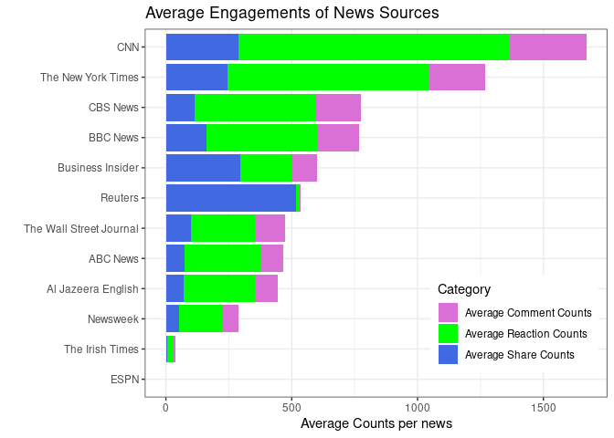
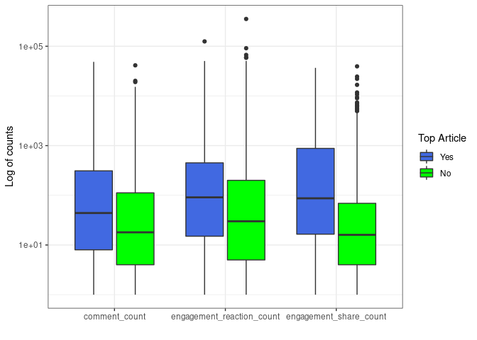
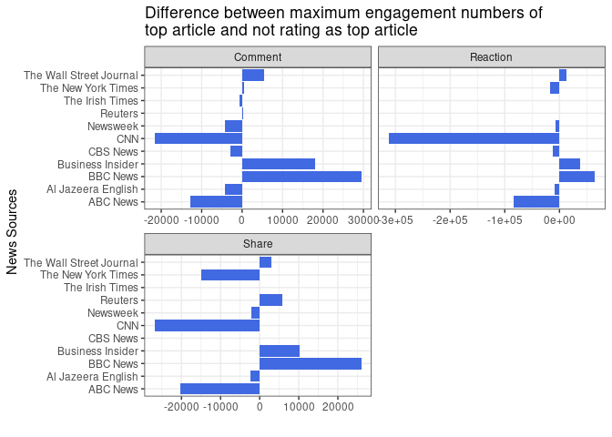
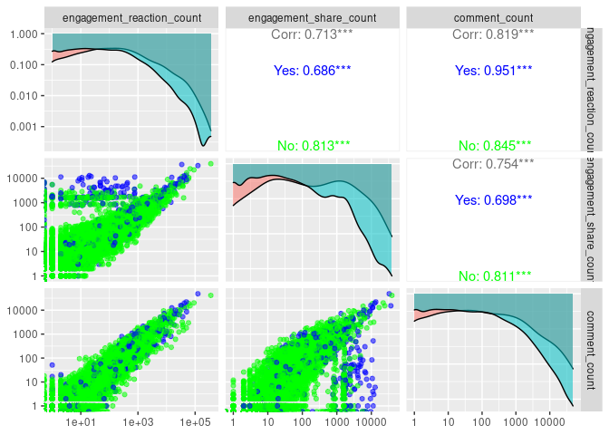
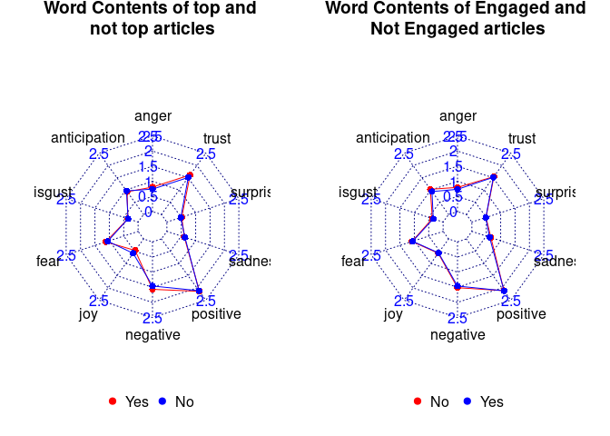
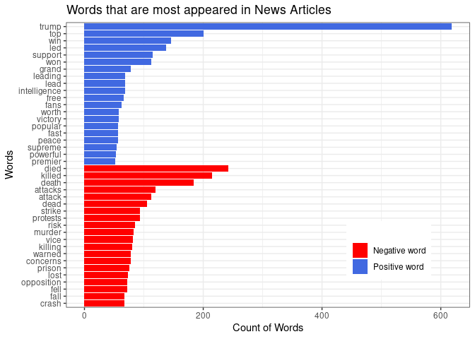
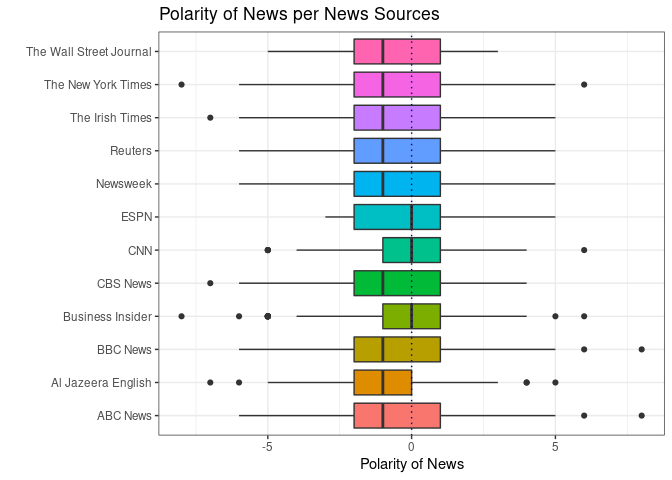

This project is based on the data set of Consumer Engagement Internet News from DataCamp's Workspace. This dataset consists of data about news articles collected from September 3, 2019 until November 4, 2019. 

This dataset contains news articles from 13 news sources such as BBC, CNN, New York Times with share, reaction and comment counts each. From this dataset, I found 5 interesting questions.  

1. Which news source got the most people's interest (engagement) rate?  

2. Is it true that top articles get the most people’s interest rate and are there any news articles that are not rated as top articles but can get people’s interest rate?  

3. Which titles of articles did most people engage in?  

4. Type of words such as positive words, negative words, emotion words, are equally contained in top and not top articles or in interested or not interested articles?  

5. Which kind of positive and negative words most appeared in news articles during those days?  

Let's start exploring.
---
First import dataset and required libraries.


```r
library(tidyverse)
library(ggplot2)
library(GGally)
library(tidytext)
library(wordcloud2)
library(fmsb)
```


```r
data <- read_csv("~/Desktop/R/data/data/news_articles.csv.gz")
```

Let's check the contents of the data.  


```r
glimpse(data)
```

```
## Rows: 10,437
## Columns: 15
## $ ...1                            <dbl> 0, 1, 2, 3, 4, 5, 6, 7, 8, 9, 10, 11, …
## $ source_id                       <chr> "reuters", "the-irish-times", "the-iri…
## $ source_name                     <chr> "Reuters", "The Irish Times", "The Iri…
## $ author                          <chr> "Reuters Editorial", "Eoin Burke-Kenne…
## $ title                           <chr> "NTSB says Autopilot engaged in 2018 C…
## $ description                     <chr> "The National Transportation Safety Bo…
## $ url                             <chr> "https://www.reuters.com/article/us-te…
## $ url_to_image                    <chr> "https://s4.reutersmedia.net/resources…
## $ published_at                    <dttm> 2019-09-03 16:22:20, 2019-09-03 10:32…
## $ content                         <chr> "WASHINGTON (Reuters) - The National T…
## $ top_article                     <dbl> 0, 0, 1, 0, 0, 0, 0, 0, 0, 0, 0, 0, 0,…
## $ engagement_reaction_count       <dbl> 0, 6, NA, 0, 0, 0, 0, 0, 4, 50, 17, 9,…
## $ engagement_comment_count        <dbl> 0, 10, NA, 0, 0, 0, 0, 0, 6, 77, 1, 7,…
## $ engagement_share_count          <dbl> 2528, 2, NA, 7, 0, 0, 817, 0, 12, 8, 2…
## $ engagement_comment_plugin_count <dbl> 0, 0, NA, 0, 0, 0, 0, 0, 0, 0, 0, 0, 0…
```

The data format are correct.  

To know which news got most people’s interest rate, first, to seek out is whether these news sources share the same amount of articles. 


```r
data %>%
    group_by(source_name) %>%
    count(source_name) %>%
    arrange(desc(n))
```

```
## # A tibble: 13 × 2
## # Groups:   source_name [13]
##    source_name                 n
##    <chr>                   <int>
##  1 Reuters                  1252
##  2 BBC News                 1242
##  3 The Irish Times          1232
##  4 ABC News                 1139
##  5 CNN                      1132
##  6 Business Insider         1048
##  7 The New York Times        986
##  8 CBS News                  952
##  9 Newsweek                  539
## 10 Al Jazeera English        499
## 11 The Wall Street Journal   333
## 12 ESPN                       82
## 13 460.0                       1
```

What is "460.0"?  


```r
data %>% 
    filter(source_name == "460.0")
```

```
## # A tibble: 1 × 15
##    ...1 source_id source_name author title description url   url_to_image
##   <dbl> <chr>     <chr>       <chr>  <chr> <chr>       <chr> <chr>       
## 1   750 1         460.0       151.0  352.0 0.0         <NA>  <NA>        
## # … with 7 more variables: published_at <dttm>, content <chr>,
## #   top_article <dbl>, engagement_reaction_count <dbl>,
## #   engagement_comment_count <dbl>, engagement_share_count <dbl>,
## #   engagement_comment_plugin_count <dbl>
```

It is nothing and remove it.  

```r
data <- data %>%
    filter(!source_name == "460.0")
```

Are there NA values? Sure, it must contain NA values :D . How many NA values?  


```r
sapply(data, function(x){sum(is.na(x))})
```

```
##                            ...1                       source_id 
##                               0                               0 
##                     source_name                          author 
##                               0                            1020 
##                           title                     description 
##                               2                              24 
##                             url                    url_to_image 
##                               0                             655 
##                    published_at                         content 
##                               0                            1291 
##                     top_article       engagement_reaction_count 
##                               1                             117 
##        engagement_comment_count          engagement_share_count 
##                             117                             117 
## engagement_comment_plugin_count 
##                             117
```

Let's check whether counts of NA values from reaction,comment and share columns are same.  

```r
data %>%
    filter(is.na(engagement_reaction_count) & is.na(engagement_comment_count) & is.na(engagement_comment_plugin_count) & is.na(engagement_share_count)) %>%
    nrow()
```

```
## [1] 117
```
Yes, they share the same rows. So drop NA values and combine engagement_comment_count and engagement_comment_plugin_count as they share same category in comment.  


```r
clean_at_counts <- data %>%
    filter(!(is.na(engagement_reaction_count) & is.na(engagement_comment_count) & is.na(engagement_comment_plugin_count) & is.na(engagement_share_count))) %>%
    mutate(comment_count = engagement_comment_count + engagement_comment_plugin_count) 
```

## Most people’s interest News Sources


```r
clean_at_counts %>% 
    # select required columns
    select("source_name", "engagement_reaction_count", "comment_count", "engagement_share_count") %>%
    group_by(source_name) %>%
    summarize(
        # Calculate the average counts for each sources
        average_reaction_count = mean(engagement_reaction_count),
        average_comment_count = mean(comment_count),
        average_share_count = mean(engagement_share_count),
        # sum for showing from largest to smallest at graph/ nothing more
        sum = average_reaction_count + average_comment_count + average_share_count,
    ) %>%
    ungroup() %>%
    # make source name as factor according to sum (from largest to smallest)
    mutate(source_name = fct_reorder(source_name, sum)) %>%
    gather(category, count, -c(source_name,sum)) %>%
    ggplot(aes(x = source_name, y = count, fill = category)) +
    geom_col() +
    coord_flip() +
    theme_bw() +
    labs(title = "Average Engagements of News Sources", y = "Average Counts per news", x = "", fill = "Category") +
    scale_fill_manual(labels = c("Average Comment Counts","Average Reaction Counts","Average Share Counts"), values = c("orchid","green","royalblue")) +
    theme(legend.position = c(0.8,0.2))
```

<!-- -->

Summation will not give the correct amount as the news sources do not share the same amount of news articles and so, I calculated with mean values with respect to each news sources. 

So, according to the graph, CNN and New York Times have the most people's interest rate than others during this period and interesting thing is ESPN has no engagements. Maybe people watch sports news from live channels and read less from websites. Next is Reuters has too many share counts compared to comment and reaction count.  

--- 

## Top Articles ??

"top_article" is said "value indicating if the article was listed as a top article on publisher website" but one interesting thing about top article is, though there was no comment, reaction, share,but said to top articles.  


```r
data %>%
    filter(top_article == 1 & engagement_comment_count == 0 & engagement_reaction_count == 0 & engagement_share_count == 0 & engagement_comment_plugin_count == 0) %>%
    group_by(source_name) %>%
    summarize(number_of_top_articles_without_engagements = n())
```

```
## # A tibble: 10 × 2
##    source_name             number_of_top_articles_without_engagements
##    <chr>                                                        <int>
##  1 ABC News                                                         1
##  2 Al Jazeera English                                              38
##  3 BBC News                                                       108
##  4 Business Insider                                                24
##  5 CBS News                                                        34
##  6 CNN                                                            104
##  7 ESPN                                                            82
##  8 Newsweek                                                        35
##  9 The Irish Times                                                  2
## 10 The Wall Street Journal                                         43
```

Yes. there are too many top articles that have no people's engagements. 

But, on average, do top articles get the most engagements?  


```r
clean_at_counts$top_article <- factor(clean_at_counts$top_article, levels = c(1,0), labels = c("Yes","No"))  
clean_at_counts[,c(11,12,14,16)] %>%
    gather(category, count, -top_article) %>%
    ggplot(aes(x = category, count, fill = top_article)) +
    geom_boxplot() +
    scale_y_log10() +
    theme_bw() +
    labs(x = "", y = "Log of counts", fill = "Top Article") +
    scale_fill_manual(values = c("royalblue", "green"))
```

```
## Warning: Transformation introduced infinite values in continuous y-axis
```

```
## Warning: Removed 13127 rows containing non-finite values (stat_boxplot).
```

<!-- -->


I made the y-axis log scale, as the range of outliers is too much. According to this boxplot, on average, it is true that top articles have greater number of people interest rate but there are outliers in not top articles that beats the maximum numbers of top articles. To be sure, the top articles have a greater number of people's interest rate, let's check.  


```r
t.test(comment_count ~ top_article, data = clean_at_counts, conf.level = 0.99)
```

```
## 
## 	Welch Two Sample t-test
## 
## data:  comment_count by top_article
## t = 3.5356, df = 1195.8, p-value = 0.0004225
## alternative hypothesis: true difference in means between group Yes and group No is not equal to 0
## 99 percent confidence interval:
##   56.98244 364.65967
## sample estimates:
## mean in group Yes  mean in group No 
##          311.2073          100.3862
```

```r
t.test(engagement_reaction_count ~ top_article, data = clean_at_counts, conf.level = 0.99)
```

```
## 
## 	Welch Two Sample t-test
## 
## data:  engagement_reaction_count by top_article
## t = 3.0275, df = 1359.4, p-value = 0.002512
## alternative hypothesis: true difference in means between group Yes and group No is not equal to 0
## 99 percent confidence interval:
##   72.34738 905.36718
## sample estimates:
## mean in group Yes  mean in group No 
##          815.3929          326.5356
```

```r
t.test(engagement_share_count ~ top_article, data = clean_at_counts, conf.level = 0.99)
```

```
## 
## 	Welch Two Sample t-test
## 
## data:  engagement_share_count by top_article
## t = 7.4985, df = 1192.1, p-value = 1.256e-13
## alternative hypothesis: true difference in means between group Yes and group No is not equal to 0
## 99 percent confidence interval:
##  314.7582 644.9653
## sample estimates:
## mean in group Yes  mean in group No 
##          622.2478          142.3861
```


Yes, it is true with even confidence level 99%. 


But there are outliers in not rating as top article, and so let's check if there are articles rating as not top article that beats the maximum engagement numbers of top article according to news sources.  


```r
clean_at_counts %>%
    select("source_name", "top_article", "engagement_reaction_count", "comment_count", "engagement_share_count") %>%
    group_by(source_name, top_article) %>%
    summarize(
        Comment = max(comment_count),
        Reaction = max(engagement_reaction_count),
        Share = max(engagement_share_count)
    ) %>%
    gather(category, max_count, -c(source_name, top_article)) %>%
    spread(top_article, max_count) %>%
    mutate(difference = `Yes` - `No`) %>%
    filter(source_name != "ESPN") %>%
ggplot(aes(source_name, difference)) +
    geom_col(fill = "royalblue") +
    coord_flip() +
    facet_wrap(~ category,nrow=2, scales = "free_x") +
    labs(x = "News Sources", y = "", title = "Difference between maximum engagement numbers of \ntop article and not rating as top article") +
    theme_bw()
```

<!-- -->

Interestingly, one CNN news article that has not been rated as top article has many more engagement counts than those that are rated as top articles from CNN. 
What is it?  What is it about?  


```r
data.frame(clean_at_counts %>%
    filter(source_name == "CNN" & engagement_reaction_count == max(engagement_reaction_count))) %>%
    select(description, url)
```

```
##                                                               description
## 1 Jimmy Carter, the oldest living former U.S. president, turns 95 cnn.com
##                                                                          url
## 1 https://www.cnn.com/2019/10/01/us/jimmy-carter-95-birthday-trnd/index.html
```

It is about the former US president, Jimmy Carter who turns the age of 95 and it is also the maximum reaction and share counts among all the news. 

---

Next is not from questions.  
There are 3 separated parameters; comment, share, and reaction. Are they associated? In general sense, it may be positively correlated. Let's look at the data set. 


```r
colnames(clean_at_counts)
```

```
##  [1] "...1"                            "source_id"                      
##  [3] "source_name"                     "author"                         
##  [5] "title"                           "description"                    
##  [7] "url"                             "url_to_image"                   
##  [9] "published_at"                    "content"                        
## [11] "top_article"                     "engagement_reaction_count"      
## [13] "engagement_comment_count"        "engagement_share_count"         
## [15] "engagement_comment_plugin_count" "comment_count"
```

```r
ggpairs(clean_at_counts[,c(11,12,14,16)], columns = 2:4, aes(color = top_article, alpha = 0.5)) +
    scale_color_manual(values = c("blue","green")) +
    scale_x_log10() + 
    scale_y_log10() 
```

<!-- -->

Blue dots are top articles and green are not. Comment and reaction counts are positively strong correlated. It makes sense. So, I will combine these three columns.  

---

## Titles of articles that most people engaged 

I think to determine whether an article is engaged/interesting or not, top articles cannot be used because as shown above there are articles that have not been rated as top articles but had most people engaged counts. And the reaction, share and comment counts are positively correlated and I will combine these columns and if summation is zero, this article has no engagement. 

Ok, let's sum up.  


```r
total_engagement_df <- clean_at_counts %>%
    mutate(total_engagements = engagement_reaction_count + comment_count + engagement_share_count) %>%
    select("news_id" = "...1",2:11,17) 

summary(total_engagement_df$total_engagements)
```

```
##     Min.  1st Qu.   Median     Mean  3rd Qu.     Max. 
##      0.0      1.0     13.0    701.7    160.5 434855.0
```

Median number is only 13 !  


```r
total_engagement_df <- total_engagement_df %>%
    mutate(interested = ifelse(total_engagements > 0, "Yes","No"),
           interested = as.factor(interested))

table(total_engagement_df$interested)
```

```
## 
##   No  Yes 
## 2485 7834
```

There are 2485 articles that have no engagement. Let's check how many NA values. 


```r
sapply(total_engagement_df, function(x){sum(is.na(x))})
```

```
##           news_id         source_id       source_name            author 
##                 0                 0                 0              1020 
##             title       description               url      url_to_image 
##                 2                24                 0               655 
##      published_at           content       top_article total_engagements 
##                 0              1291                 0                 0 
##        interested 
##                 0
```

There are only 2 NA values in title column.  

> There is a problem with wordcloud2 in rendering to html output that allows only one picture and does not allow second picture, so I skip my first picture of showing wordcloud with one word.  


```r
two_words <- total_engagement_df %>%
    filter(!is.na(title) & interested == "Yes") %>%
    select(news_id, title) %>%
    unnest_tokens(ngram, title, token="ngrams", n=2, stopwords = stop_words$word) %>% filter(!ngram %in% c("york times","street journal","wall street")) %>%
    count(ngram) %>%
    arrange(desc(n)) %>%
    top_n(50)
    
wordcloud2(two_words)
```

```{=html}
<div id="htmlwidget-a0d2fc6cdff85355b5fe" style="width:672px;height:480px;" class="wordcloud2 html-widget"></div>
<script type="application/json" data-for="htmlwidget-a0d2fc6cdff85355b5fe">{"x":{"word":["hurricane dorian","hong kong","world cup","boris johnson","white house","rugby world","trade war","climate change","impeachment inquiry","donald trump","deal brexit","iphone 11","saudi arabia","saudi oil","9 11","live stream","north korea","bernie sanders","national security","robert mugabe","boat fire","north carolina","update 1","elizabeth warren","john bolton","tropical storm","trump impeachment","ashes england's","evening news","pm johnson","security adviser","tv channel","antonio brown","brexit deal","county championship","south africa","supreme court","trump's trade","andrew yang","channel live","death toll","eye opener","goldman sachs","live updates","san francisco","11 pro","2019 watch","border wall","boris johnson's","business insider","gun control","house democrats","joe biden","kong protesters","real estate","social media","stream odds",null],"freq":[107,100,71,60,41,38,36,35,35,34,33,28,28,28,27,24,24,23,23,23,22,22,21,20,20,17,17,16,16,16,16,16,15,15,15,15,15,15,14,14,14,14,14,14,14,13,13,13,13,13,13,13,13,13,13,13,13,13],"fontFamily":"Segoe UI","fontWeight":"bold","color":"random-dark","minSize":0,"weightFactor":1.68224299065421,"backgroundColor":"white","gridSize":0,"minRotation":-0.785398163397448,"maxRotation":0.785398163397448,"shuffle":true,"rotateRatio":0.4,"shape":"circle","ellipticity":0.65,"figBase64":null,"hover":null},"evals":[],"jsHooks":{"render":[{"code":"function(el,x){\n                        console.log(123);\n                        if(!iii){\n                          window.location.reload();\n                          iii = False;\n\n                        }\n  }","data":null}]}}</script>
```

> first run, the words "york times","street journal" contain a lot, so I removed them. 

Yes, these are the most frequent topic from all engaged news articles.  

---

## Emotional words !!  

Emotional words equally contain in top article news or in not a top article news.  

Let's filter the columns.  
At first, I did that way.--->
> So, most words contain in content column but there are many NAs in that columns and I replaced them from description column.  

But it didn't work in calculating at polarity scores from description as it contains few words and make wrong results.  


```r
description_text <- total_engagement_df %>%
    select(news_id, source_name, top_article, interested, text = "content") %>%   
    filter(!is.na(text))
```

Joined from "NRC" words that are classified as 10 categories;positive, negative, fear, trust, etc.


```r
nrc_words <- description_text %>%
    select(-2) %>% 
    unnest_tokens(word, text) %>%
    anti_join(stop_words) %>%
    inner_join(get_sentiments("nrc"))

head(nrc_words)
```

```
## # A tibble: 6 × 5
##   news_id top_article interested word   sentiment   
##     <dbl> <fct>       <fct>      <chr>  <chr>       
## 1       0 No          Yes        board  anticipation
## 2       0 No          Yes        model  positive    
## 3       0 No          Yes        fire   fear        
## 4       0 No          Yes        truck  trust       
## 5       0 No          Yes        series trust       
## 6       0 No          Yes        board  anticipation
```

I want to classify them with top_article category and engagement/interesting category.  


```r
top_article_nrc <- nrc_words %>%
    group_by(news_id, top_article) %>%
    count(sentiment) %>%
    spread(sentiment, n, fill = 0) %>%
    gather(category, score, -c("news_id","top_article")) %>%
    group_by(top_article, category) %>%
    summarize(average_score = mean(score)) %>%
    spread(top_article, average_score)
head(top_article_nrc)
```

```
## # A tibble: 6 × 3
##   category       Yes    No
##   <chr>        <dbl> <dbl>
## 1 anger        0.809 0.743
## 2 anticipation 0.929 0.962
## 3 disgust      0.354 0.349
## 4 fear         1.12  1.06 
## 5 joy          0.470 0.585
## 6 negative     1.57  1.46
```

```r
interested_nrc <- nrc_words %>%
    group_by(news_id, interested) %>%
    count(sentiment) %>%
    spread(sentiment, n, fill = 0) %>%
    gather(category, score, -c("news_id","interested")) %>%
    group_by(interested, category) %>%
    summarize(average_score = mean(score)) %>%
    spread(interested, average_score)
head(interested_nrc)
```

```
## # A tibble: 6 × 3
##   category        No   Yes
##   <chr>        <dbl> <dbl>
## 1 anger        0.799 0.736
## 2 anticipation 1.03  0.936
## 3 disgust      0.374 0.342
## 4 fear         1.08  1.06 
## 5 joy          0.583 0.568
## 6 negative     1.51  1.46
```

At first, I tried with chartJSradar but it does not appear when rendering to html. It is easy to use and just one line of code. So, try to make chartJSradar to png but cannot find the solution. So, I make the radar chart from library "fmsb". It is too handy and graph is not that pretty. Are there any methods?  


Let's see on graphs.  


```r
radar_df <- function(df) {
    trans <- data.frame(t(df[,2:3]))
    colnames(trans) <- df$category
    min_max <- data.frame(matrix(rep(c(2.5,0),10), nrow=2))
    colnames(min_max) <- df$category
    radar <- rbind(min_max, trans)
    return(radar)
}

top_article <- radar_df(top_article_nrc)
top_interest <- radar_df(interested_nrc)

op <- par(mar = c(1, 2, 2, 2))
par(mfcol = c(1,2))
radarchart(top_article, caxislabels = c(seq(0,2.5,0.5)), seg=5, plty=1, pcol=c("red","blue"), title="Word Contents of top and \nnot top articles",axistype = 3)

legend("bottom",legend = rownames(top_article[-c(1,2),]), col = c("red","blue"), pch = 20,bty = "n",text.col = "black", cex = 1, pt.cex = 1.5,horiz=TRUE,)

radarchart(axistype=3, top_interest, caxislabels = c(seq(0,2.5,0.5)), seg=5, plty=1, pcol=c("red","blue"), title="Word Contents of Engaged and \nNot Engaged articles")

legend("bottom",legend = rownames(top_interest[-c(1,2),]), col = c("red","blue"), pch = 20,bty = "n",text.col = "black", cex = 1, pt.cex = 1.5,horiz=TRUE)
```



```r
par(op)
```

It seems all the contents have same average amount of all kinds of words. Yes, that makes sense as articles contain all types of feelings. It is nice to see positive words take most.  

---

## Most appeared Positive and Negative Words From All Articles  

Which positive and negative words can be seen from these articles during these days?  

Let's find.  


```r
description_text %>%
    select(text) %>%
    unnest_tokens(word, text) %>%
    anti_join(stop_words) %>%
    inner_join(get_sentiments("bing")) %>%
    group_by(sentiment) %>%
    count(word) %>%
    group_by(sentiment) %>%
    arrange(desc(n)) %>%
    top_n(20) %>%
    mutate(word = fct_reorder(word, n)) %>%
    ggplot(aes(word, n, fill = sentiment)) +
        geom_col() +
        coord_flip() +
        labs(y = "Count of Words", x = "Words", title = "Words that are most appeared in News Articles", fill = "") + 
        theme_bw() +
        scale_fill_manual(labels = c("Negative word","Positive word"), values = c("red","royalblue")) +
        theme(legend.position = c(0.8,0.2))
```

<!-- -->


Yes, these are the words that occur frequently in those news articles. But one word has only rough analysis. Positive words may mix with negative words. Let's find polarity in each articles.    


```r
pos_neg_words <- description_text %>%
  select(news_id, text) %>%
  unnest_tokens(word, text) %>%
  anti_join(stop_words) %>%
  inner_join(get_sentiments("bing")) %>%
  group_by(news_id) %>%
  count(sentiment) %>%
  spread(sentiment, n, fill=0) %>%
  mutate(diff = positive - negative) %>%
  inner_join(description_text, by="news_id")


pos_neg_words %>%
  group_by(source_name) %>%
  ggplot(aes(source_name, y = diff, fill=source_name)) +
  geom_boxplot() + 
  geom_hline(yintercept=0, linetype = "dotted", color = "darkblue") +
  labs(x = "", y = "Polarity of News", title = "Polarity of News per News Sources") +
  coord_flip() +
  theme_bw() +
  theme(legend.position="none")
```

<!-- -->

Most of the news from new sources have negative polarity on average. 
Let's test the differences in polarity are true or not.  
First find the maximum and minimum numbers of polarity.  


```r
max(pos_neg_words$diff)
```

```
## [1] 8
```

```r
min(pos_neg_words$diff)
```

```
## [1] -8
```
Range is 8 to -8. 
Let see the news that contains most positive words from content.  


```r
data.frame(pos_neg_words %>%
    filter(diff == 8) %>%
    inner_join(total_engagement_df[,c("news_id","url")], by="news_id") %>%
    select(source_name, url))
```

```
##   news_id source_name
## 1    1072    ABC News
## 2    4153    BBC News
##                                                                                                    url
## 1 https://abcnews.go.com/Entertainment/wireStory/us-poet-laureate-rita-dove-wins-100000-prize-65404706
## 2                                                        https://www.bbc.co.uk/sport/football/49652716
```
Yes, they are not bad news.  

Next see the news that contains most negative words from content.  


```r
data.frame(pos_neg_words %>%
    filter(diff == -8) %>%
    inner_join(total_engagement_df[,c("news_id","url")], by="news_id") %>%
    select(source_name, url))
```

```
##   news_id        source_name
## 1    1890   Business Insider
## 2    5577 The New York Times
##                                                                                             url
## 1                      https://www.businessinsider.com/ways-to-get-richer-build-wealth-big-wins
## 2 https://www.nytimes.com/2019/09/14/world/middleeast/saudi-arabia-refineries-drone-attack.html
```
Imm...one is true, it is about saudi_arabia drone attack. Next is why. 


```r
pos_neg_words %>%
    filter(diff == -8 & news_id == 1890) %>%
    select(text) %>%
    unnest_tokens(word, text) %>%
    anti_join(stop_words) %>%
    inner_join(get_sentiments("bing"))
```

```
## # A tibble: 8 × 3
## # Groups:   news_id [1]
##   news_id word      sentiment
##     <dbl> <chr>     <chr>    
## 1    1890 afraid    negative 
## 2    1890 difficult negative 
## 3    1890 worried   negative 
## 4    1890 losing    negative 
## 5    1890 losing    negative 
## 6    1890 irony     negative 
## 7    1890 worst     negative 
## 8    1890 mistake   negative
```

It contains "afraid","difficult", etc and no positive words.  

